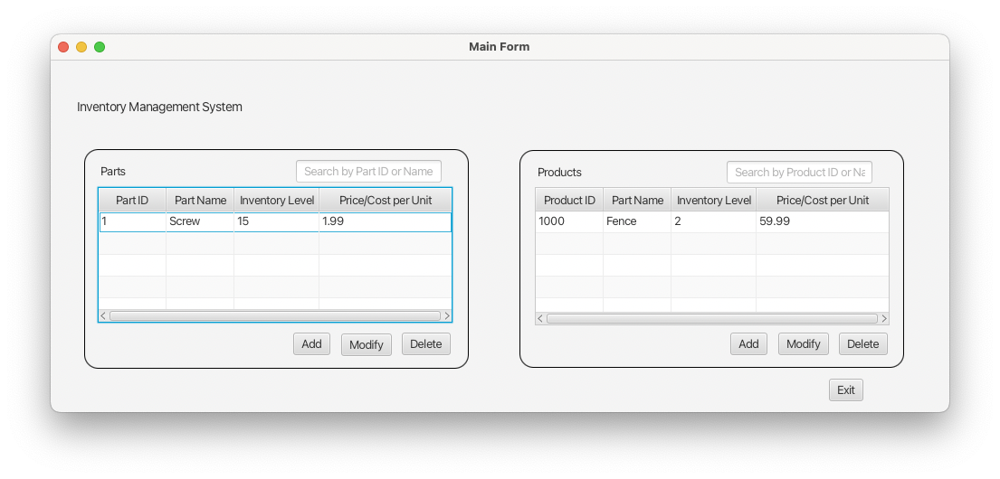
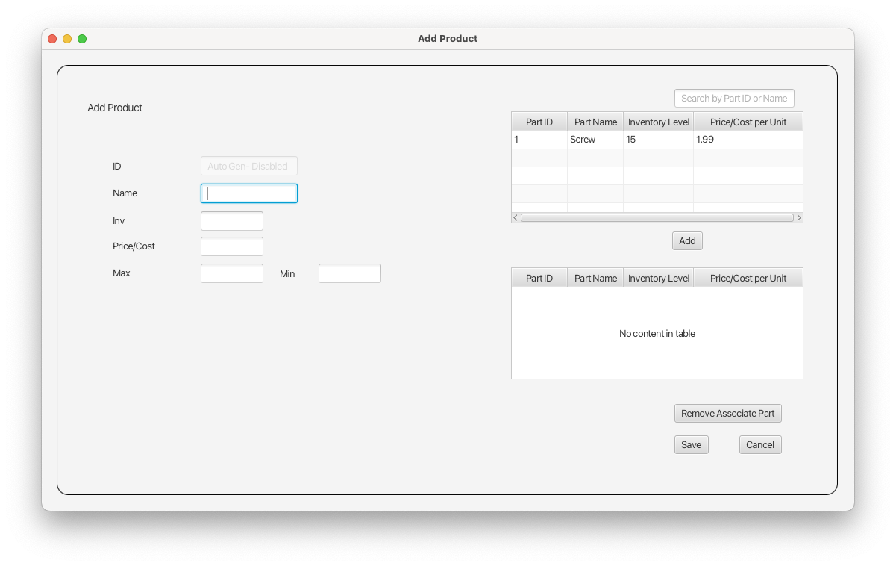
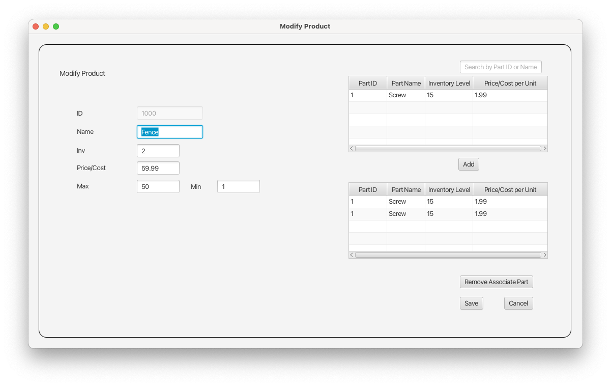

<div id="top"></div>
<!--
*** Thanks for checking out the Best-README-Template. If you have a suggestion
*** that would make this better, please fork the repo and create a pull request
*** or simply open an issue with the tag "enhancement".
*** Don't forget to give the project a star!
*** Thanks again! Now go create something AMAZING! :D
-->


<!-- PROJECT SHIELDS -->
<!--
*** I'm using markdown "reference style" links for readability.
*** Reference links are enclosed in brackets [ ] instead of parentheses ( ).
*** See the bottom of this document for the declaration of the reference variables
*** for contributors-url, forks-url, etc. This is an optional, concise syntax you may use.
*** https://www.markdownguide.org/basic-syntax/#reference-style-links
-->

<!-- PROJECT LOGO -->
<br />
<div align="center">
  <a href="https://github.com/tdiego1/Inventory_Tracking_System">
    
  </a>

<h3 align="center">Inventory Tracking System</h3>

  <p align="center">
    The purpose of this application is to add, modify, and delete parts and products.
  </p>
</div>


<!-- TABLE OF CONTENTS -->
<details>
  <summary>Table of Contents</summary>
  <ol>
    <li>
      <a href="#about-the-project">About The Project</a>
      <ul>
        <li><a href="#built-with">Built With</a></li>
      </ul>
    </li>
    <li>
      <a href="#getting-started">Getting Started</a>
      <ul>
        <li><a href="#prerequisites">Prerequisites</a></li>
        <li><a href="#installation">Installation</a></li>
      </ul>
    </li>
    <li><a href="#usage">Usage</a></li>
    <li><a href="#roadmap">Roadmap</a></li>
    <li><a href="#contact">Contact</a></li>
  </ol>
</details>


<!-- ABOUT THE PROJECT -->
## About The Project

![Product Name Screen Shot][product-screenshot]

<b>Business Problem</b>: You are working for a small manufacturing organization that has outgrown its current inventory system. 
Members of the organization have been using a spreadsheet program to manually enter inventory additions, deletions, and other 
data from a paper-based system but would now like you to develop a more sophisticated inventory program.


<p align="right">(<a href="#top">back to top</a>)</p>


### Development Environment
* [IntelliJ Community 2021.1.3](https://www.jetbrains.com/idea/)
* [Java SE 17.0.1](https://www.java.com/en/)
* [JavaFX SDK 17.0.1](https://gluonhq.com/products/javafx/)

<p align="right">(<a href="#top">back to top</a>)</p>


<!-- GETTING STARTED -->
## Getting Started

### Prerequisites

* Install IntelliJ Community 2021.1.3
* Install Java SE 17.0.1
* Install JavaFX SDK 17.0.1

### Installation

1. Download project
2. Open project in IntelliJ
3. Ensure JavaFX is added to project libraries
4. Add JavaFX path variable, `PATH_TO_FX`, in IntelliJ preferences with location of JavaFX
5. Edit run configuration
   1. Modify Options and Add VM options
   2. Add line to VM options
      ```
      --module-path ${PATH_TO_FX} --add-modules javafx.fxml,javafx.controls,javafx.graphics
      ```

<p align="right">(<a href="#top">back to top</a>)</p>


<!-- USAGE EXAMPLES -->
## Usage
### Main Screen
The main screen is where parts and products are listed in tables. New parts and products can be created or a selection can 
be made to modify or delete them.


### Add Part Screen
Parts can be added with a unique part ID generated.


### Modify Part Screen
Parts can also be modified from a selection on the main screen. All fields can be edited except for Part IDs.


### Add Product Screen
Products can be added with all fields editable except for the product ID. Individual parts that were added previously can 
be added from the top table to the bottom table. The bottom table lists the all the associated parts to each product.


### Modify Product Screen
Products can be modified from a selection on the main screen. 



<p align="right">(<a href="#top">back to top</a>)</p>

<!-- ROADMAP -->
## Roadmap

- [x] Main Screen
  - [x] Parts pane
  - [x] Products pane
  - [x] Accept selection from panes to add, modify, and delete
- [x] Add Part Screen
  - [x] Add all fields to part object
- [x] Modify Part Screen
    - [x] User can modify all fields except ID
- [x] Add Product Screen
  - [x] auto-populate top parts pane with all parts
- [x] Modify Product Screen
  - [x] Auto-populate top parts pane with all parts
  - [x] Auto-populate bottom pane with associated parts
    

<!-- See the [open issues](https://github.com/github_username/repo_name/issues) for a full list of proposed features (and known issues). -->

<p align="right">(<a href="#top">back to top</a>)</p>

<!-- CONTACT -->
## Contact

Diego Torres - tdiego001@gmail.com

Project Link: [https://github.com/tdiego1/Inventory_Tracking_System](https://github.com/tdiego1/Inventory_Tracking_System)

[![Linkedin Diego Torres][linkedin-shield]][linkedin-url]
<p align="right">(<a href="#top">back to top</a>)</p>

<!-- MARKDOWN LINKS & IMAGES -->
<!-- https://www.markdownguide.org/basic-syntax/#reference-style-links -->
[contributors-shield]: https://img.shields.io/github/contributors/github_username/repo_name.svg?style=for-the-badge
[contributors-url]: https://github.com/github_username/repo_name/graphs/contributors
[forks-shield]: https://img.shields.io/github/forks/github_username/repo_name.svg?style=for-the-badge
[forks-url]: https://github.com/github_username/repo_name/network/members
[stars-shield]: https://img.shields.io/github/stars/github_username/repo_name.svg?style=for-the-badge
[stars-url]: https://github.com/github_username/repo_name/stargazers
[issues-shield]: https://img.shields.io/github/issues/github_username/repo_name.svg?style=for-the-badge
[issues-url]: https://github.com/github_username/repo_name/issues
[license-shield]: https://img.shields.io/github/license/github_username/repo_name.svg?style=for-the-badge
[license-url]: https://github.com/github_username/repo_name/blob/master/LICENSE.txt
[linkedin-shield]: https://img.shields.io/badge/-LinkedIn-black.svg?style=for-the-badge&logo=linkedin&colorB=555
[linkedin-url]: https://linkedin.com/in/diegotorres001
[product-screenshot]: images/project-img.png
